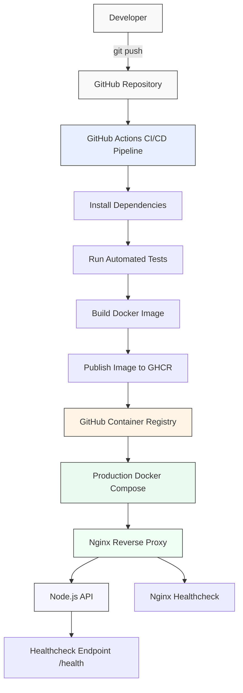
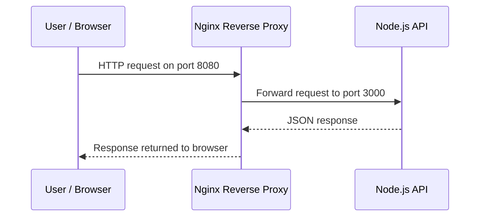

# Architecture Overview

Related documentation:  
[English README](../README.md) | [README Français](README.fr.md) | [README Deutsch](README.de.md)

## Global DevOps Architecture

This diagram shows the complete DevOps workflow of the project, from local development to production deployment.



---

## Architecture Explanation

### 1. Local Development

The developer works locally on the Node.js API and pushes code changes to GitHub.

### 2. GitHub Repository

The GitHub repository stores the complete project source code, including:

- Node.js source code
- Dockerfile
- Docker Compose configuration
- Nginx configuration
- GitHub Actions workflow
- Deployment scripts
- Documentation

### 3. GitHub Actions CI/CD Pipeline

After each push to the main branch, GitHub Actions automatically starts the CI/CD workflow.

The pipeline performs the following steps:

```txt
1. Install dependencies
2. Run automated tests
3. Build the Docker image
4. Publish the Docker image to GitHub Container Registry
```

### 4. GitHub Container Registry

The Docker image is published to GitHub Container Registry and can be pulled later by the production environment.

Example image format:

```txt
ghcr.io/bleriotwafo/devops-portfolio-api:latest
```

### 5. Production Docker Compose

The production Docker Compose file starts the application by pulling the prebuilt image from GitHub Container Registry.

This avoids building the image directly on the production server.

### 6. Nginx Reverse Proxy

Nginx receives incoming HTTP requests and forwards them to the Node.js API.

```txt
Client → Nginx → Node.js API
```

### 7. Healthchecks

Both the API and Nginx include healthchecks.

This allows Docker to verify whether the services are actually responding correctly, not only whether the containers are running.

---

## Simplified Request Flow



---

## Summary

This architecture demonstrates a complete DevOps workflow with:

- automated testing
- Docker image creation
- container registry publishing
- production deployment configuration
- reverse proxy setup
- container health monitoring
- deployment automation

The project is intentionally simple on the application side, but production-oriented on the DevOps side.